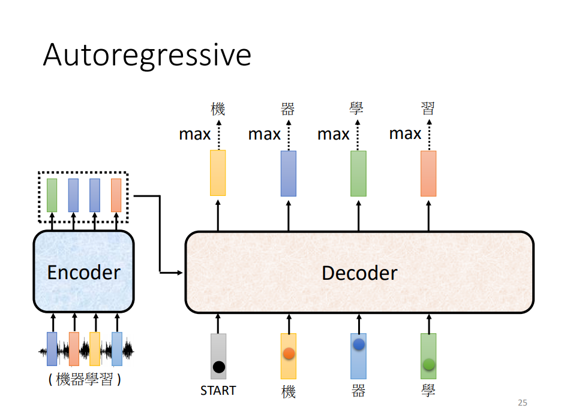
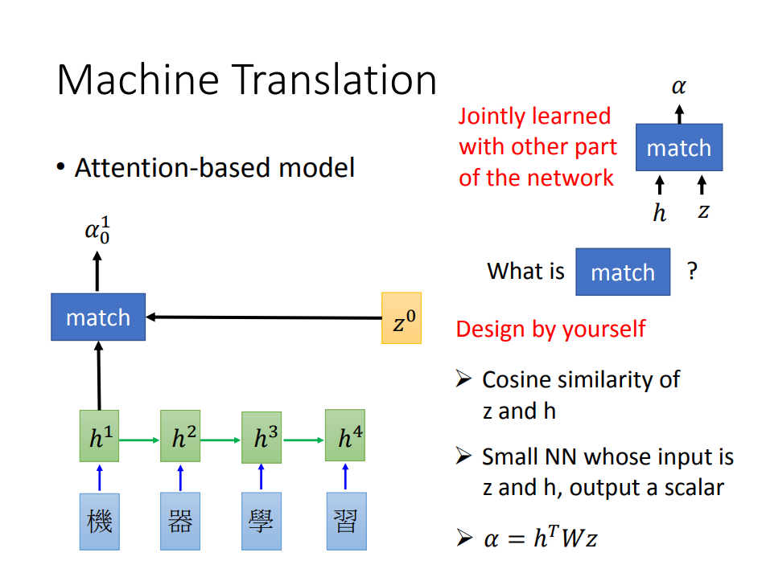
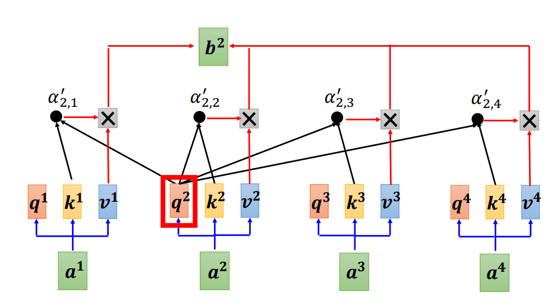

# 说说Transformer

[seq2seq](https://speech.ee.ntu.edu.tw/~hylee/ml/ml2021-course-data/seq2seq_v9.pdf)

Transformer要做的是seq2seq。

那就先说说seq2seq。seq2seq的一种常见做法分两步来做。比如seq1到seq2，第一步，把seq1的信息提炼出来，即**Encoding**，第二步，用提炼出来的信息生成seq2，即**Decoding**，RNN似乎很适合做这个差事。

但是RNN做这个活是有问题的，它不能并行化，它总是要从一边到另一边，一步步的提取出信息，然后一步步的生成新的sequence。

Transformer用到一个玩意叫Self-attention。这里又用到了attention，那就提一嘴attention，**Attention**还是得好好说说。

之前说到seq2seq的第一步Encoding是提炼出信息，这个信息当然就是一个vector了。问题是一个vector够吗？那不够的话就需要**多个不同的vector**，那怎么生成多个不同的vector呢？不同的attention（注意力），注意力集中在1、3、5生成一个vector，注意力在2、4、6又生成一个vector。

所谓的注意力，就是为此阶段的输出（下一阶段的输入）加一组权重，哪里权重大就说注意力集中在哪里。那这个权重的系数怎么来呢，普通方法（RNN）不是可以得到一个vector吗，用这个vector和inputs运算便可以得到。所以说，Attention其实就是一个vec和一堆vec（inputs）两两运算，然后得到在那一堆vec（inputs）上的一组权重。

终于要进入正题了，**Self-attention**。

Self-attention这个名字就已经清楚了，是自己和自己做attention，在seq内部做attention。首先想想，Self-attention也是要做seq2seq，输入 $$[a^1,a^2,a^3,...]$$ 是多个，输出$$[b^1,b^2,b^3,...]$$也是多个\(为了和图片一致，使用上标\)。为了得到输出seq中的第i个：$$b^i$$，我们先需要对输入seq做attention（这里再次说明，“做attention”意味着一对多两两运算，然后得到一对多的权重），得到权重之后再利用这组权重对输入seq求和，这样就得到了$$b^i$$。让我们回顾这个过程，输入seq中的每个$$a^j,j\in{1,2,3...}$$，都需要两个向量做attention，一个主动去找别人做attention，另一个被别人做attention。比如$$a^1$$产生的向量$$q^1$$主动和其他做attention，得到的权重就用来生成$$b^1$$ ，同时她又需要生成向量$$k^1$$被人配对；得到权重之后又需要向量$$v^1$$用来按权重求和。这就是不明觉厉的 {q,k,v} 三元组。q为query，即为主动去找别人，v为value，即用来产生最后的输出值。

$$a^1$$怎么生成$$q^1 k^1 v^1$$，当然就是线性变换了，这些也都是需要学习的参数。整个过程都是矩阵乘法，可以并行化。

实际中使用的，是**Multi-head Self-attention**。

$$q^i$$进一步产生多个同维向量$$q^{i,1},q^{i,2}...$$ $$k,v$$也是一样，这样就可以得到$$b^{i,1},b^{i,2}...$$，再把他们合并成$b^i$。这就是所谓的multi-head，这样做每一个head可以只关注一方面的信息。

到这里还差最后一点，self-attention是没有位置、顺序这个概念的。输入的顺序打乱，对模型是没有什么影响的，这显然是不合理的。那么就引入了_位置向量_。

不同的位置对应不同的位置向量，这样妇人和人妇就不一样了。

那接下来的问题，怎么把这个位置向量加进去。答案就是加进去，没错，加进去就可以了。把位置向量$$e^i$$与$$a^i$$相加，$$a^i=e^i+a^i$$就可以。

